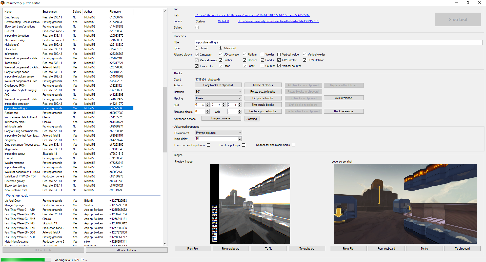

# Infinieditor

Hello, Infinifactory friends. Back in 2017 I created a tool for editing Infinifactory levels - InfiniEditor.

## Features

* List all of your custom and workshop levels as well as some of the ingame levels with their type, author, filename and information whether it's solved or not.
* Open level and change its Name, type, allowed blocks, environment, input delay, input parameters, preview image and screenshot.
* Similarly to InfiniXML you can use this program to alter puzzle blocks - but InfiniEditor was designed so that you don't have to export blocks to a xml file, edit it and import again - you can do most basic operations within the application with a help of your clipboard - copying blocks between levels, bulk operations like shifting, rotating, flipping, or replacing one block type with another. But if you feel like it, you can paste the blocks to your favourite text editor as XML too!
* Block Reference! - A catalogue of all ingame blocks (including those that aren't available in the Advanced ingame editor!) sorted into the advanced editor groups containing all the info about the blocks - name, group, id, bounding box, symmetries and image of course!
You can use this to find a id of a block for the replace feature, or as a visual reference that the ingame advanced editor is missing perhaps to find matching blocks for your build.
* Scripting! If the basic operations available are not enough for you, you can do custom actions using the built in scripting (in Lua).

## GUI
Main window  

Blocks cataloug  

Scripting  

